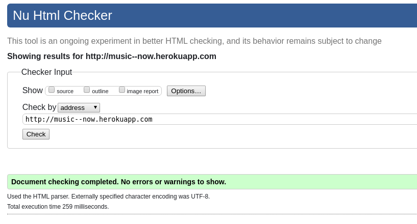
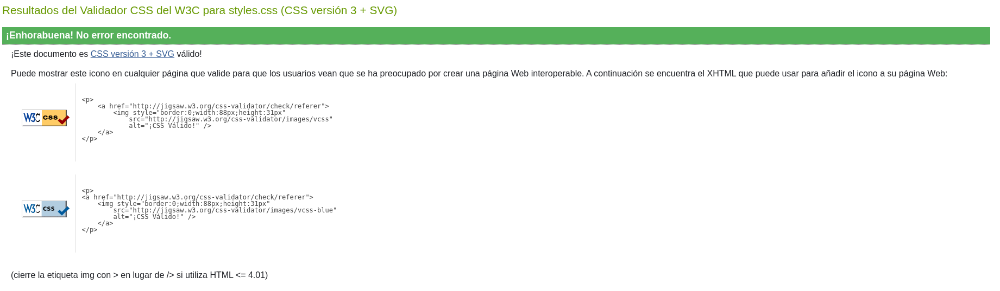
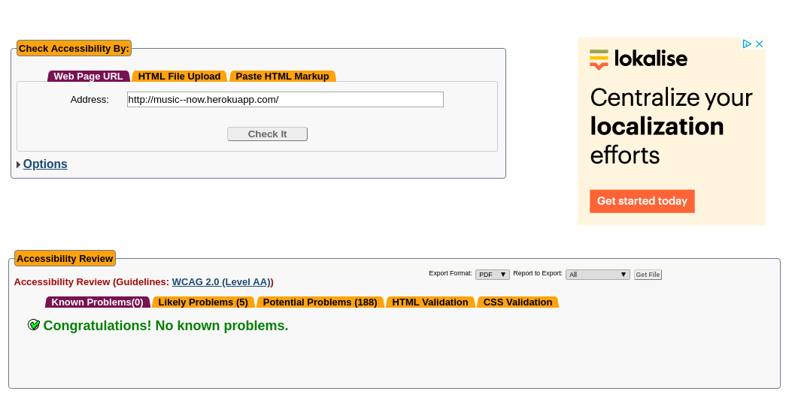
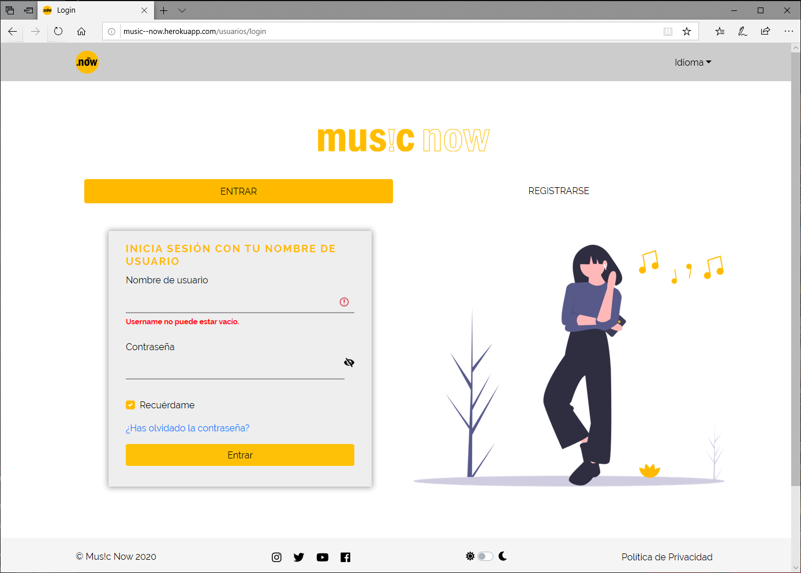
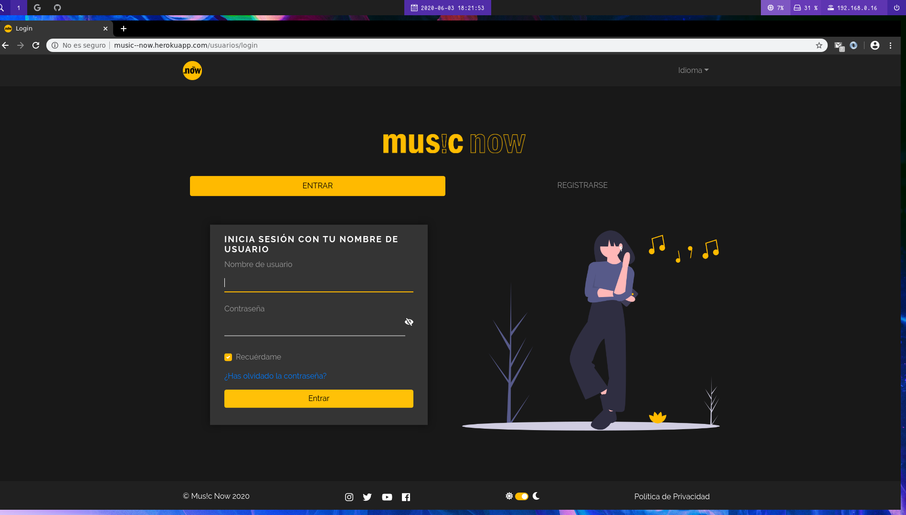
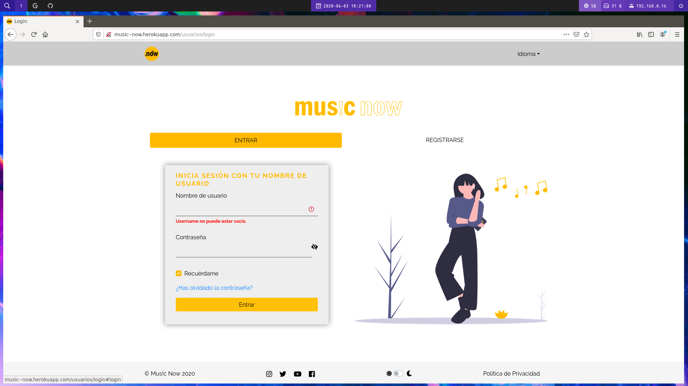
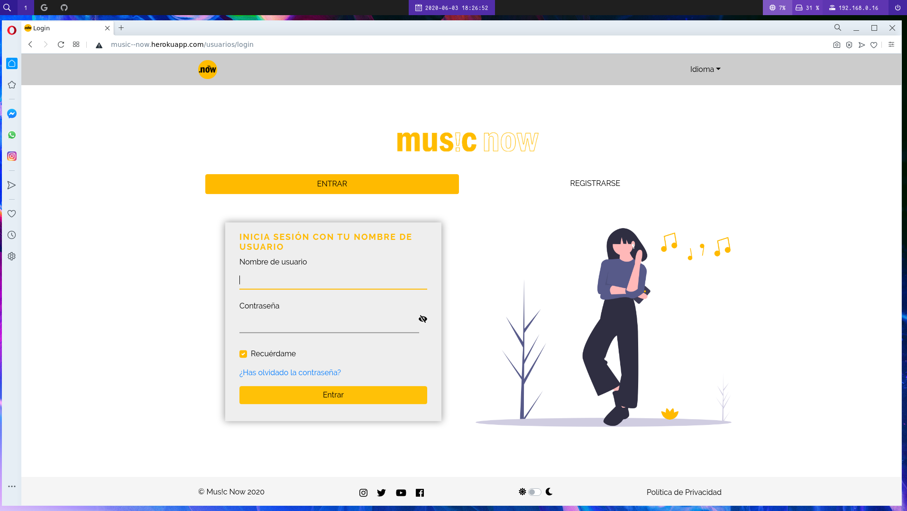
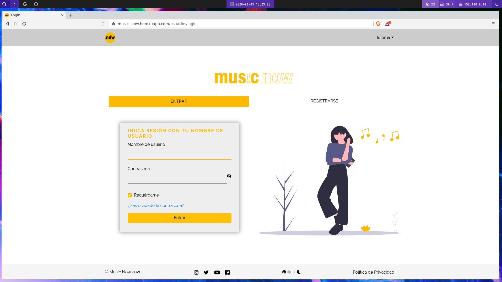

# Anexos
---

## **([R34](https://github.com/alevidals/musicnow/issues/34)) Validación HTML5, CSS3 y accesibilidad**

### Validación HTML5

### Validación CSS

### Validación accesibilidad AA

---

## **([R36](https://github.com/alevidals/musicnow/issues/36)) Varios navegadores**

### Microsoft Edge

### Google Chrome

### Mozilla Firefox

### Opera

### Brave

---

## **([R25](https://github.com/alevidals/musicnow/issues/25)) Codeception**

### TODO

---

### Prueba del seis

 1. ¿Qué sitio es éste?
    - En todo momento podemos saber que sitio es debido a que en la barra superior existe un logo que indica que estamos en esta página y en la barra inferior (footer) está indicado el nombre de la página por lo que siempre vamos a tener presentes que estamos dentro de Mus!c Now.

 2. ¿En qué página estoy?
    - Siempre vamos a saber en qué página estoy debido a que Mus!c Now incorpora en casi todas las página migas de pan (breadcrumbs) para saber donde estamos. Además con ayuda de las pretty urls con solo echar un vistazo también vamos a saber dónde estamos.

 3. ¿Cuales son las principales secciones del sitio?
    - Las principales secciones del sitio son:
        - Inicio: la página principal.
        - Tendencias: página donde vamos a poder ver que canciones son tendencia el mes actual.
        - Chat: página dónde vamos a poder chatear con los amigos (personas que se siguen mutuamente).
        - Administrar: es menú desplegable de administración con las siguiente opciones: Álbumes, Canciones, Comentarios y Playlists.
        - En forma de imagen un menú desplegable con enlace a la cuenta de perfil, a configurar el perfil y a cerrar sesión.

 4. ¿Qué opciones tengo en este nivel?
    - En este nivel además de tener posibilidad de navegar haciendo clic en las secciones anteriormente comentadas, tenemos una barra de búsqueda para buscar canciones, álbumes y usuarios. Debajo de esta barra, tendremos en forma de lista vertical las canciones que vayan subiendo las personas que seguimos y podremos escucharlas, darles likes, agregarlas a cola o a playlists.

 5. ¿Dónde estoy en el esquema de las cosas?
    - Al existir migas de pan (breadcrumbs) y al hacer uso de las pretty urls en todo momento vamos saber dónde estoy en el esquema de las cosas.

 6. ¿Cómo busco algo?
    - En la página principal tenemos un búscador que filtra por canciones, álbumes y  usuarios.