# Manual de usuario

Al entrar en la aplicación veremos una pantalla como esta:

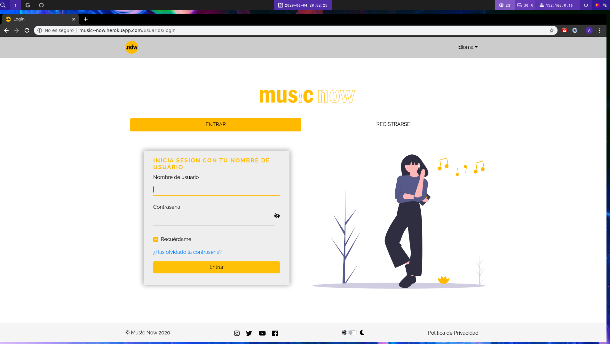

En esta pantalla vamos a poder iniciar sesión o registrarnos.

Una vez iniciamos sesión nos aparecerá una pantalla como esta:

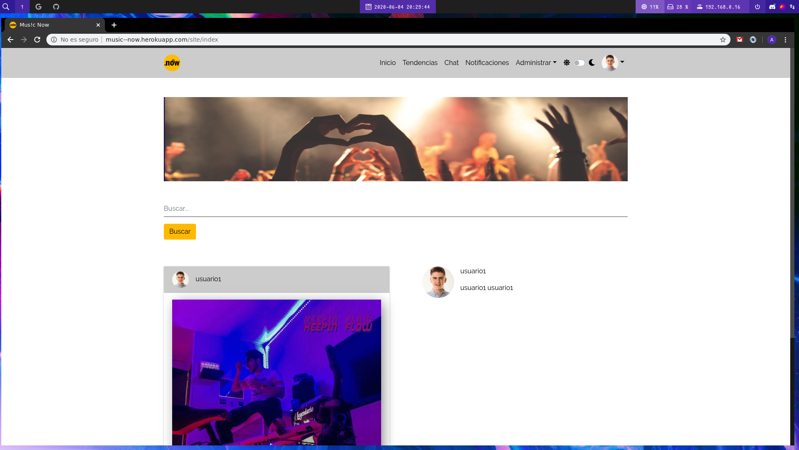

En esta pantalla vamos a ver todas las canciones nuestras y de los usuarios que seguimos, si hacemos hover sobre una canción tendremos 5 botones

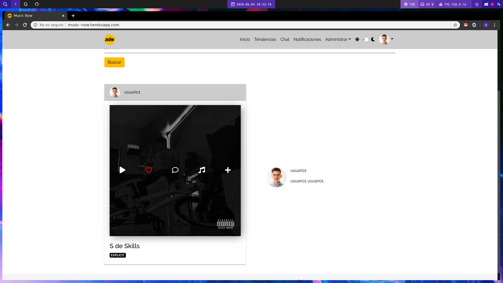

Los iconos nos permitirán hacer lo siguiente:
- Play: reproducir la canción.
- Like: dar o quitar like.
- Comentario: abre un modal para comentar.
- Nota musical: para añadir la canción a la cola de reproducción.
- Más: abre un modal para agregar la canción a una playlist.

En el apartado tendencias veremos las canciones más escuchadas y con más likes del mes actual en forma de lista, ahí podremos reproducirlas y agregarlas a cola o a playlists.

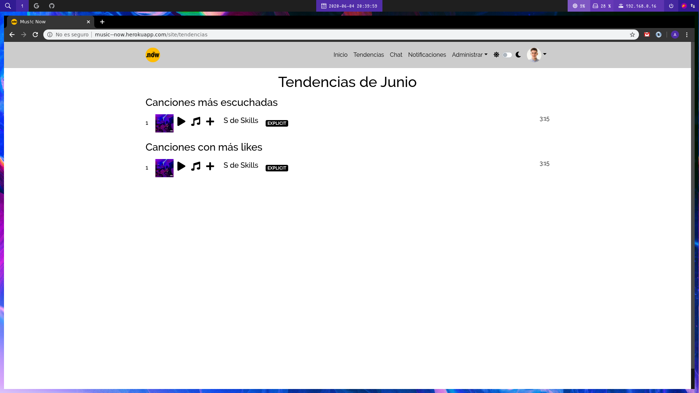

En el apartado de chat apareceran los amigos (usuarios que se siguen mutuamente) y con los que podrás comunicarte.

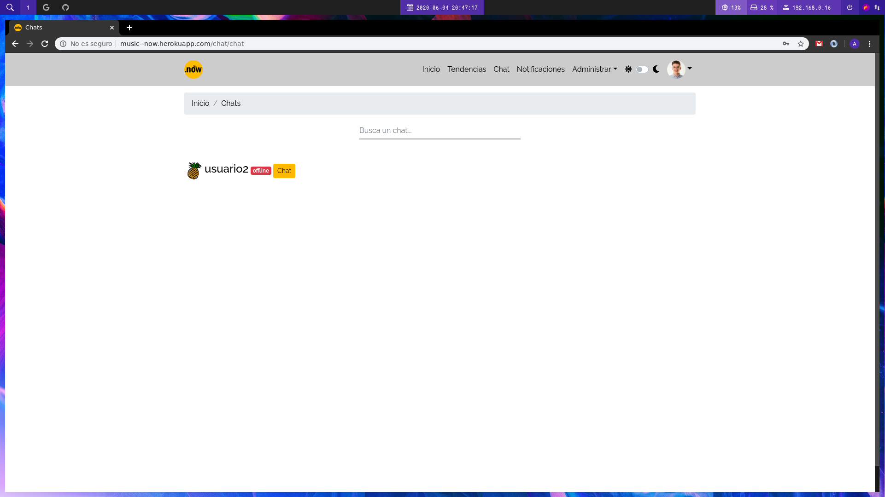

Si le damos a chat podremos hablar con los amigos.

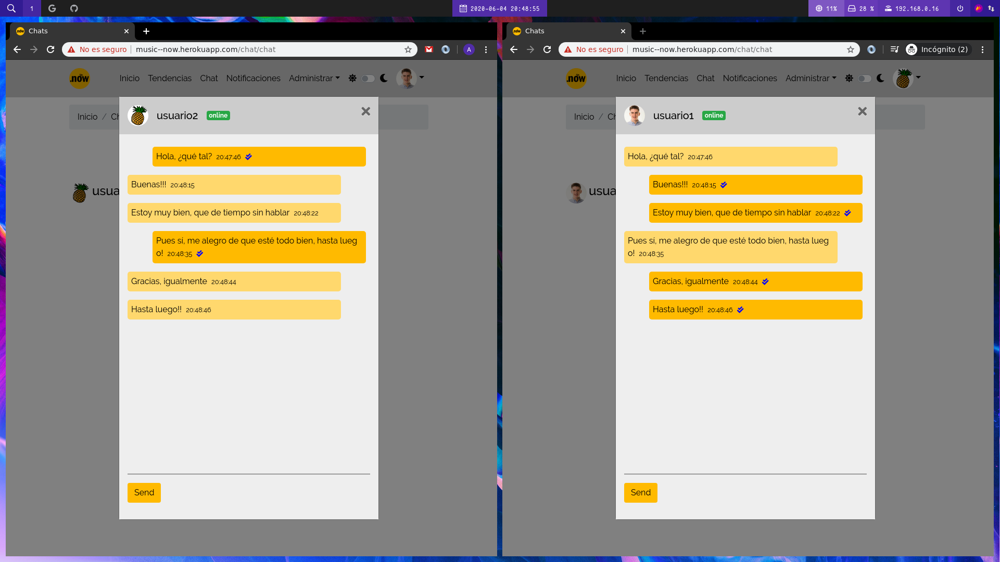

En el apartado de notificaciones aparecerán las solicitudes de seguimiento en el caso de que nuestro perfil sea privado.

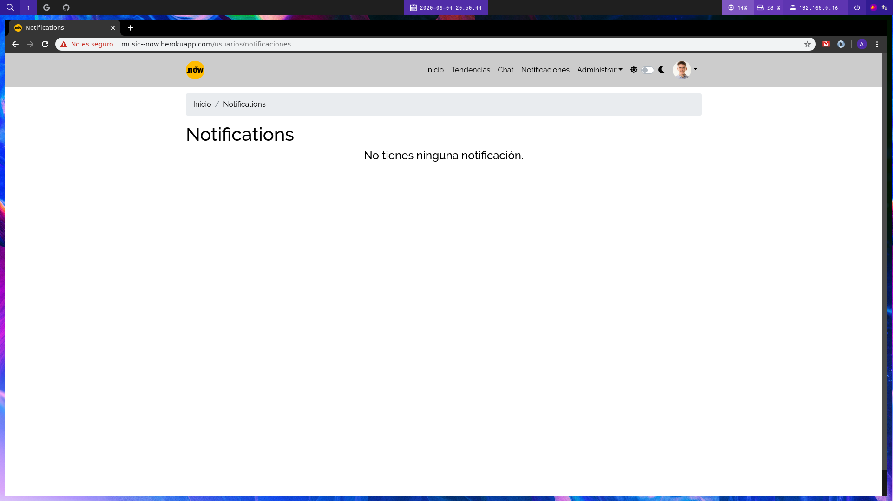

En el apartado de administración vamos a poder administrar los álbumes, canciones y playlists.
Para crear una canción vamos al apartado de canciones y le damos al botón Añadir una canción se nos abrirá este formulario.

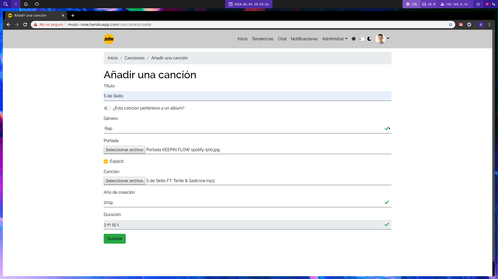

Si le damos a guardar la canción y la portada se subiría al servidor de almacenamiento Firebase. Este proceso se repite con álbumes y playlists.

Para cambiar entre el modo claro y oscuro le hariamos clic en el switch de la barra superior.

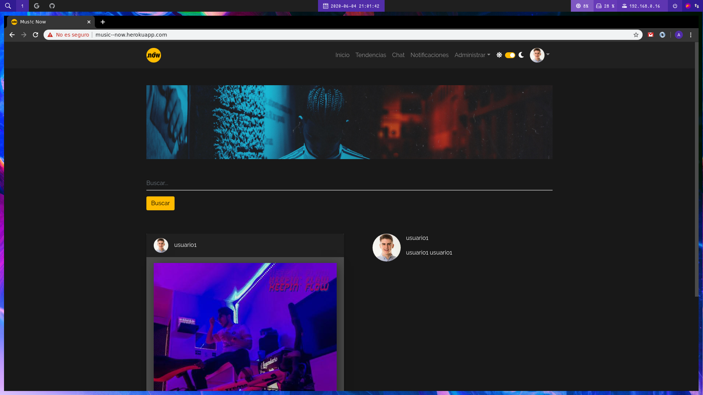

Si vamos al perfil de un usuario veremos la siguiente vista:

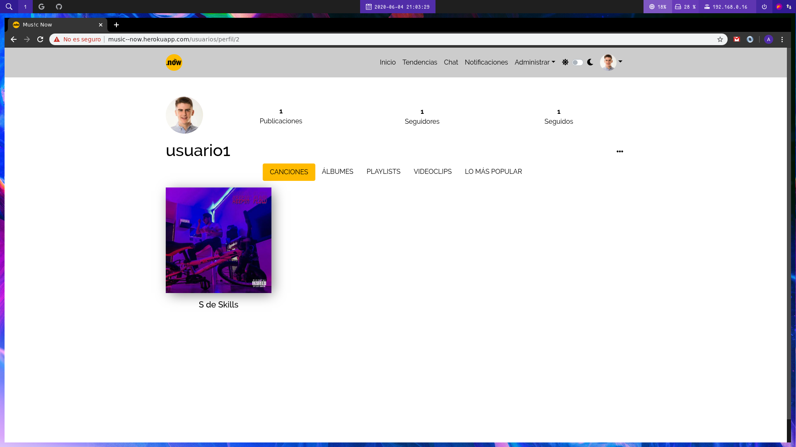

Las canción tienen el mismo menú hover que las canciones en la página principal.

Si hacemos clic en la imagen de perfil de la parte superior derecha y le damos a configurar perfil iremos a la página de configuración.

En la pestaña de editar perfil podremos editar el perfil, nombre, apellidos, login, contraseña, etc.

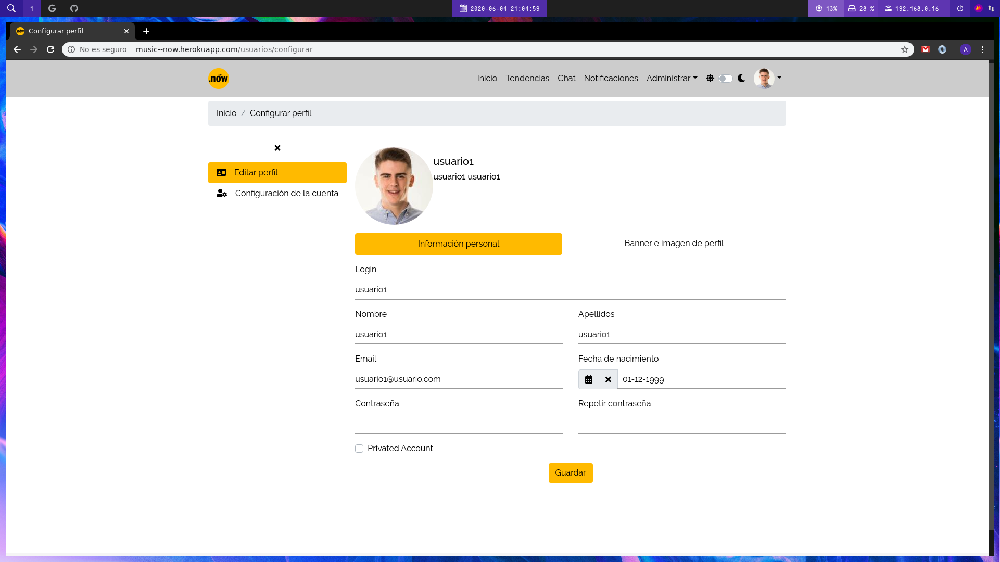

En la pestaña de configuración de la cuenta vamos a configurar cosas como el idioma, podremos acceder a cuenta premium, eliminar la cuenta o las imágenes, etc.

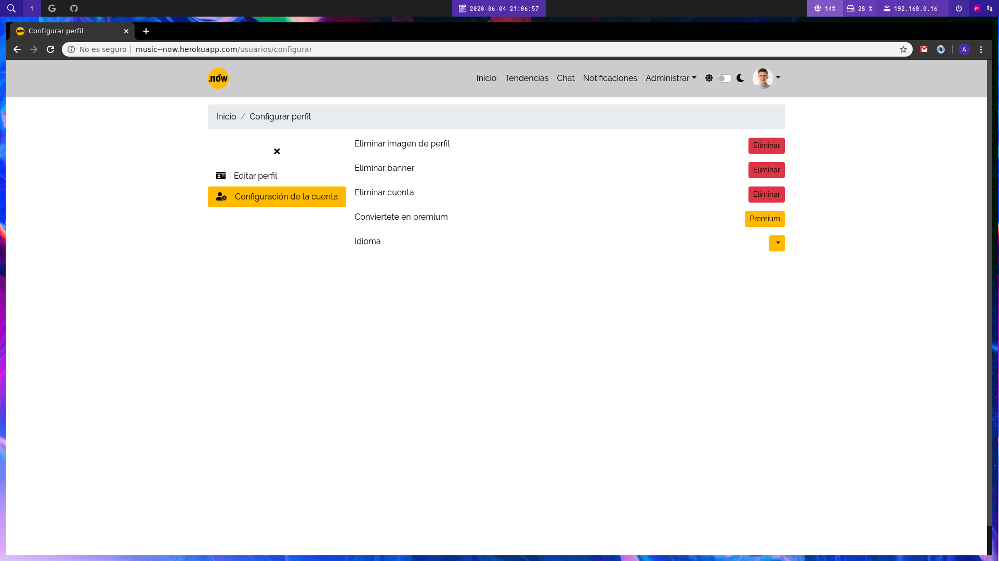
